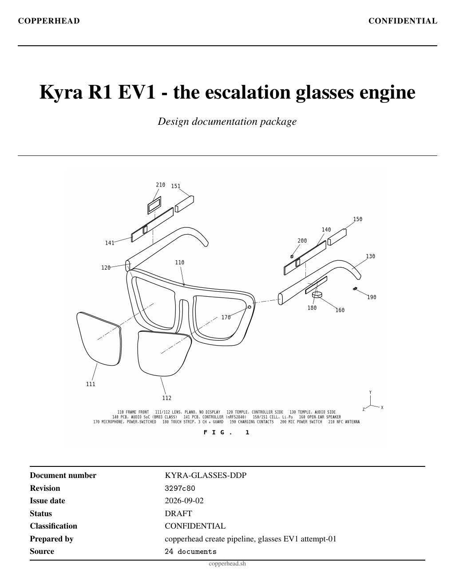
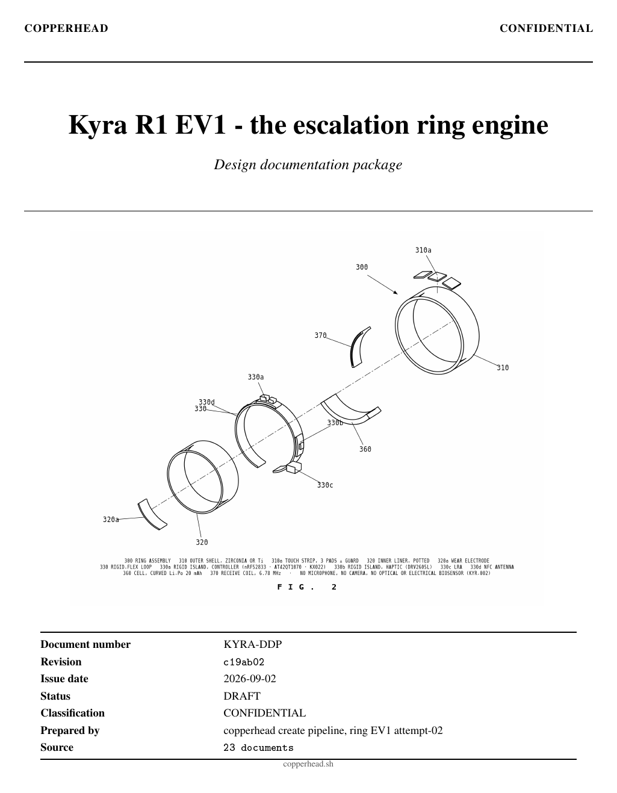

On 27 August I [replied](https://x.com/animeshsingh38/status/2093044844423946444) to
[Kyra](https://kyrainterface.com/)'s founder [Sahil Dhull](https://x.com/_sahildhull)
that hardware design should move as fast as software<a href="#ref-1">[1]</a>.
On 2 September we tried to prove it with Kyra's own public roadmap, which is one
sentence. We took two boards to part selection before lunch. This is the record, with
the commits.

<figure class="embed">
<blockquote class="twitter-tweet">
Rank 27 in JEE Advanced. 230 in JEE Mains out of 1.5 million fellow candidates.  Nah! Wasn&#39;t enough.  Raised $1.2M, backed by a16z Speedrun, building AI agents.  Still Nah! Wasn&#39;t enough.  I wanted hardware too - the actual thing on your body, not just the software behind it.… <a href="https://t.co/IVbMheUFzZ">pic.twitter.com/IVbMheUFzZ</a>
&mdash; sahil dhull (@_sahildhull) <a href="https://x.com/_sahildhull/status/2092983875933004244?ref_src=twsrc%5Etfw">August 27, 2026</a></blockquote>

</figure>

## The reports

<figure class="two-up">

<figcaption>The first page of each design package, glasses on the left and ring on the right. Each opens the full PDF.</figcaption>
</figure>

| Design package                                   | Revision  | Pages | File                                                                                  |
| ------------------------------------------------ | --------- | ----: | ------------------------------------------------------------------------------------- |
| Kyra R1 EV1, the escalation glasses engine       | `3297c80` |    88 | [PDF, 0.9 MB](/blog/kyra-glasses-ev1-design-package-3297c80.pdf)                     |
| Kyra R1 EV1, the escalation ring engine          | `c19ab02` |   102 | [PDF, 1.0 MB](/blog/kyra-ring-ev1-design-package-c19ab02.pdf)                         |

| Drawing                                   | Sheet                                 | File                                                                     |
| ----------------------------------------- | ------------------------------------- | ------------------------------------------------------------------------ |
| FIG. 1, the glasses exploded              | patent style, reference numerals      | <a href="/blog/figures/kyra-glasses-exploded.svg" download>SVG</a>               |
| FIG. 2, the ring exploded along its axis  | patent style, reference numerals      | <a href="/blog/figures/kyra-ring-exploded.svg" download>SVG</a>                  |
| KYRA-GL-001, the glasses, dimensioned     | A3, 1:1, third angle                  | <a href="/blog/figures/kyra-glasses-drawing-KYRA-GL-001.svg" download>SVG</a>    |
| KYRA-RG-001, the ring, dimensioned        | A4, 2:1, third angle, section A-A     | <a href="/blog/figures/kyra-ring-drawing-KYRA-RG-001.svg" download>SVG</a>       |

<aside class="notice">

<strong>DISCLOSURE:</strong> Kyra is not a client. Nobody at Kyra was contacted and
nobody there has seen any of this. Everything below was derived from Kyra's <a
href="https://kyrainterface.com/">public page</a> and one <a
href="https://www.linkedin.com/feed/update/urn:li:activity:7500590483107344384/">public
post</a> by its founder. It demonstrates a process and makes no claim about Kyra's
product.

</aside>

## The input

Kyra's entire public hardware specification, quoted in full from
[kyrainterface.com](https://kyrainterface.com/)<a href="#ref-2">[2]</a>:

> Mac and iOS first, because that is where your work happens. Then ambient glasses
> controlled by a ring: reply, dismiss or confirm with your thumb.

Plus a privacy commitment: your data stays with you. No part numbers, no budgets, no
dimensions, no display or camera decision. The same morning, Sahil Dhull [posted a
working V0 of the
glasses](https://www.linkedin.com/feed/update/urn:li:activity:7500590483107344384/),
demonstrated by making a phone call through them<a href="#ref-3">[3]</a>.
That post settled one question the sentence did not: the glasses have an audio path.

## The record

Hashes are commits in the two design repositories; each stage of the pipeline commits
when its completion contract holds, so the hash is the evidence<a href="#ref-4">[4]</a><a href="#ref-5">[5]</a>. The pipeline is `copperhead create`.
The scope was its first three stages, specification, architecture and part selection,
stopped by design at the schematic boundary.

|                         | Ring               | Glasses            |
| ----------------------- | ------------------ | ------------------ |
| Workspace created       | `f4a625b`          | `ed41083`          |
| Stage 1, specification  | 25m 19s, `786b723` | 28m 17s, `0c2f005` |
| Stage 2, architecture   | 11m 01s, `370678f` | 7m 51s, `abad67f`  |
| Stage 3, part selection | 43m 28s, `c19ab02` | 48m 44s, `3297c80` |
| Stages 1 to 3           | 1h 20m             | 1h 25m             |
| Placed symbols          | 90                 | 90                 |
| Design package          | 102 pages          | 88 pages           |

The ring's brief was written the night before, from the sentence above and a market
study, with ten engineering decisions taken in the absence of a client and the
consequence of each written down. The glasses' brief was written while the ring ran,
after every candidate part had been checked against the 222 symbol libraries on the
machine, because a part without a symbol makes a run unwinnable. Between the two sits
the contract that ties the boards together: glasses as the escalation surface, ring as
the confirm surface, four links between them and the phone. Both design packages were
assembled from the stage commits: brief, specification, architecture, bill of
materials, decision log, change log and every requirement file.

## What each stage cost

Every figure here is read off the Claude Agent SDK's own usage record, one line per API
call and priced at the published Claude Opus 5 rates: $5 per million input tokens, $10
per million written to the one hour cache, $0.50 per million read back from it and $25
per million output tokens<a href="#ref-6">[6]</a>. The model was
`claude-opus-5` for every call.

| Board and stage            | Wall clock | API calls | Output tokens | Cache write, 1h |    Cache read |       Cost |
| -------------------------- | ---------- | --------: | ------------: | --------------: | ------------: | ---------: |
| Ring, 1 specification      | 25m 19s    |        16 |        48,022 |         369,825 |        35,848 |      $4.92 |
| Ring, 2 architecture       | 11m 01s    |        21 |        19,494 |         186,902 |       206,946 |      $2.46 |
| Ring, 3 part selection     | 43m 28s    |        39 |        60,084 |         409,312 |       676,154 |      $5.93 |
| **Ring, stages 1 to 3**    | **1h 20m** |    **76** |   **127,600** |     **966,039** |   **918,948** | **$13.31** |
| Glasses, 1 specification   | 28m 17s    |        24 |        33,360 |         420,245 |        48,267 |      $5.06 |
| Glasses, 2 architecture    | 7m 51s     |        15 |        13,924 |         108,977 |       111,505 |      $1.49 |
| Glasses, 3 part selection  | 48m 44s    |        46 |        88,789 |         361,341 |       648,214 |      $6.16 |
| **Glasses, stages 1 to 3** | **1h 25m** |    **85** |   **136,073** |     **890,563** |   **807,986** | **$12.71** |
| **Both boards**            | **2h 45m** |   **161** |   **263,673** |   **1,856,602** | **1,726,934** | **$26.02** |

Uncached input across the six stages is 164 tokens. The harness writes each turn's
context into the one hour cache and reads it back on the next turn, so the bill sits in
two lines: cache writes at $18.57 and output tokens at $6.59. Reads are $0.86. Writes
cost more than output because every turn appends to the context and the appended part
is written at twice the input price. The five minute cache would have halved that line,
but stage 3 turns ran past five minutes often enough that the one hour cache is the
right choice.

Part selection is the largest line on both boards, 45 percent of the ring's bill and 48
percent of the glasses'. It is also where the wall clock goes: 43 and 49 minutes against
under half an hour for a specification.

## What came out

| Figure                                  | Glasses EV1, `3297c80`         | Ring EV1, `c19ab02`          |
| --------------------------------------- | ------------------------------ | ---------------------------- |
| Placed symbols, against the ceiling     | 90 of 110                      | 90 of 105                    |
| Parts, all symbol and pin verified      | 77                             | 78                           |
| Radios                                  | BM83 audio, nRF52840           | nRF52833, VDDH mode          |
| Standby                                 | 3.25 mA ledger                 | 96.9 µA itemised             |
| Design figure against target and ceiling | 4.77 mA against 8 and 12 mA   | 116.3 µA against 150 and 177 µA |
| Predicted endurance                     | about 50 h on 240 mAh usable   | about 6 days on 17 mAh usable |
| Stage-3 turns used, cap 80              | 46                             | 35 then 38                   |
| Package                                 | 88 pages                       | 102 pages                    |

_FIG. 1. Glasses, exploded. No display, no camera. Microphone power is a hardware switch
under the application controller, off unless the wearer opens a call or a reply.
Reference numerals key to the requirement register. [Download the
SVG](/blog/figures/kyra-glasses-exploded.svg)._

_FIG. 2. Ring, exploded along its axis. No microphone, no camera, no optical or
electrical biosensor: the one window on the inner liner is a wear-detect electrode.
Every shipping smart ring is a capture device<a href="#ref-7">[7]</a><a
href="#ref-8">[8]</a><a href="#ref-9">[9]</a>; this one is a control device. The
architecture follows the published Open Ring design record<a href="#ref-10">[10]</a>. [Download the SVG](/blog/figures/kyra-ring-exploded.svg)._

## The glasses, as designed

Two radios, because an iPhone carries a call over Bluetooth Classic and the Kyra app
needs a Bluetooth Low Energy data channel and a central role toward the ring. The audio
module owns the call path and the charger; the controller module owns the sensors, the
touch strip, the microphone switch and both BLE links. Everything off the board is
dashed.

_Glasses EV1 block diagram. [Download the
SVG](/blog/figures/kyra-glasses-block-diagram.svg)._

The 23 parts that are not passives, from the bill of materials committed at `3297c80`.
Every part number is a proposal, flagged unverified in the BOM itself; the package
column is the KiCad footprint the symbol was checked against.

| Refdes | Value | Package | MPN (proposed, unverified) |
| --- | --- | --- | --- |
| U1 | BM83 | Microchip_BM83 | BM83SM1-00AA |
| U2 | MDBT50Q-1MV2 | Raytac_MDBT50Q | MDBT50Q-1MV2 |
| U3 | AT42QT1070 | QFN-20-1EP_4x4mm_P0.5mm_EP2.6x2.6mm | AT42QT1070-MMHR |
| U4 | KX022-1020 | LGA-12_2x2mm_P0.5mm | KX022-1020 |
| U5 | AP9101CK | SOT-23-5 | AP9101CK5-AATRG1 |
| U6 | PAM8302A | MSOP-8-1EP_3x3mm_P0.65mm_EP1.68x1.88mm | PAM8302AADCR |
| U7 | PAM8302A | MSOP-8-1EP_3x3mm_P0.65mm_EP1.68x1.88mm | PAM8302AADCR |
| Q1 | DMG2301L | SOT-23 | DMG2301L-7 |
| Q2 | SI2302 | SOT-23 | SI2302CDS-T1-GE3 |
| Q3 | SI2302 | SOT-23 | SI2302CDS-T1-GE3 |
| D1 | PESD5V0L1BA | D_SOD-323 | PESD5V0L1BA,115 |
| D2 | Green | LED_0603_1608Metric | LTST-C191KGKT |
| L1 | 10uH | L_0805_2012Metric | LQM2HPN100MG0L |
| J1 | USB-C 16P | USB_C_Receptacle_USB2.0_16P | USB4105-GF-A |
| J2 | Conn_01x02 | JST_SH_BM02B-SRSS-TB_1x02-1MP_P1.00mm_Vertical | BM02B-SRSS-TB(LF)(SN) |
| J3 | Conn_01x02 | JST_SH_BM02B-SRSS-TB_1x02-1MP_P1.00mm_Vertical | BM02B-SRSS-TB(LF)(SN) |
| J4 | Conn_01x02 | JST_SH_BM02B-SRSS-TB_1x02-1MP_P1.00mm_Vertical | BM02B-SRSS-TB(LF)(SN) |
| J5 | Conn_01x06 | Molex_505110-0692_1x06-1MP_P0.50mm_Horizontal | 505110-0692 |
| J6 | Conn_01x06 | Molex_505110-0692_1x06-1MP_P0.50mm_Horizontal | 505110-0692 |
| J7 | Conn_01x02 | JST_SH_BM02B-SRSS-TB_1x02-1MP_P1.00mm_Vertical | BM02B-SRSS-TB(LF)(SN) |
| J8 | Conn_02x05 | PinHeader_2x05_P1.27mm_Vertical_SMD | FTSH-105-01-L-DV-K |
| J9 | Conn_01x04 | PinHeader_1x04_P2.54mm_Vertical | 61300411121 |
| J10 | Conn_01x02 | PinHeader_1x02_P2.54mm_Vertical | 61300211121 |

The other 67 rows: passives, crystals, test points and mounting holes

| Refdes | Value | Package | MPN (proposed, unverified) |
| --- | --- | --- | --- |
| R1 | 1k | R_0402_1005Metric | RC0402FR-071KL |
| R2 | 5.1k | R_0402_1005Metric | RC0402FR-075K1L |
| R3 | 5.1k | R_0402_1005Metric | RC0402FR-075K1L |
| R4 | 330R | R_0402_1005Metric | RC0402FR-07330RL |
| R5 | 2k | R_0402_1005Metric | RC0402FR-072KL |
| R6 | 10k | R_0402_1005Metric | RC0402FR-0710KL |
| R7 | 10k | R_0402_1005Metric | RC0402FR-0710KL |
| R8 | 10k | R_0402_1005Metric | RC0402FR-0710KL |
| R9 | 100k | R_0402_1005Metric | RC0402FR-07100KL |
| R10 | 120k | R_0402_1005Metric | RC0402FR-07120KL |
| R11 | 120k | R_0402_1005Metric | RC0402FR-07120KL |
| R12 | 100R | R_0402_1005Metric | RC0402FR-07100RL |
| R13 | 100R | R_0402_1005Metric | RC0402FR-07100RL |
| R14 | 100R | R_0402_1005Metric | RC0402FR-07100RL |
| R15 | 100R | R_0402_1005Metric | RC0402FR-07100RL |
| R16 | 10R | R_0402_1005Metric | RC0402FR-0710RL |
| R17 | 100k | R_0402_1005Metric | RC0402FR-07100KL |
| R18 | 1k | R_0402_1005Metric | RC0402FR-071KL |
| R19 | 1k | R_0402_1005Metric | RC0402FR-071KL |
| R20 | 1k | R_0402_1005Metric | RC0402FR-071KL |
| R21 | 1k | R_0402_1005Metric | RC0402FR-071KL |
| R22 | 1k | R_0402_1005Metric | RC0402FR-071KL |
| R23 | 4.7k | R_0402_1005Metric | RC0402FR-074K7L |
| R24 | 4.7k | R_0402_1005Metric | RC0402FR-074K7L |
| R25 | 10k | R_0402_1005Metric | RC0402FR-0710KL |
| R26 | 10k | R_0402_1005Metric | RC0402FR-0710KL |
| C1 | 10uF | C_0805_2012Metric | GRM21BR61C106KE15L |
| C2 | 100nF | C_0402_1005Metric | CL05B104KO5NNNC |
| C3 | 100nF | C_0402_1005Metric | CL05B104KO5NNNC |
| C4 | 4.7uF | C_0603_1608Metric | GRM188R61A475KE15D |
| C5 | 10uF | C_0805_2012Metric | GRM21BR61A106KE19L |
| C6 | 100nF | C_0402_1005Metric | CL05B104KO5NNNC |
| C7 | 4.7uF | C_0603_1608Metric | GRM188R61A475KE15D |
| C8 | 100nF | C_0402_1005Metric | CL05B104KO5NNNC |
| C9 | 100nF | C_0402_1005Metric | CL05B104KO5NNNC |
| C10 | 4.7uF | C_0603_1608Metric | GRM188R61C475KAAJ |
| C11 | 10uF | C_0805_2012Metric | GRM21BR61A106KE19L |
| C12 | 100nF | C_0402_1005Metric | CL05B104KO5NNNC |
| C13 | 1uF | C_0402_1005Metric | CL05A105KA5NQNC |
| C14 | 4.7uF | C_0603_1608Metric | GRM188R61A475KE15D |
| C15 | 1uF | C_0402_1005Metric | CL05A105KA5NQNC |
| C16 | 220nF | C_0402_1005Metric | CL05B224KO5NNNC |
| C17 | 220nF | C_0402_1005Metric | CL05B224KO5NNNC |
| C18 | 220nF | C_0402_1005Metric | CL05B224KO5NNNC |
| C19 | 220nF | C_0402_1005Metric | CL05B224KO5NNNC |
| C20 | 100nF | C_0402_1005Metric | CL05B104KO5NNNC |
| C21 | 100nF | C_0402_1005Metric | CL05B104KO5NNNC |
| C22 | 10uF | C_0805_2012Metric | GRM21BR61A106KE19L |
| C23 | 1uF | C_0402_1005Metric | CL05A105KA5NQNC |
| C24 | 100nF | C_0402_1005Metric | CL05B104KO5NNNC |
| C25 | 100nF | C_0402_1005Metric | CL05B104KO5NNNC |
| C26 | 100nF | C_0402_1005Metric | CL05B104KO5NNNC |
| C27 | 100pF | C_0402_1005Metric | GJM1555C1H101JB01D |
| C28 | 100pF | C_0402_1005Metric | GJM1555C1H101JB01D |
| TP1 | GND | TestPoint_Pad_D1.0mm | none (pad or hole) |
| TP2 | GND | TestPoint_Pad_D1.0mm | none (pad or hole) |
| TP3 | VBAT_PROT | TestPoint_Pad_D1.0mm | none (pad or hole) |
| TP4 | VDD_3V0 | TestPoint_Pad_D1.0mm | none (pad or hole) |
| TP5 | MIC_VDD | TestPoint_Pad_D1.0mm | none (pad or hole) |
| TP6 | BT_UART_TXD | TestPoint_Pad_D1.0mm | none (pad or hole) |
| TP7 | BT_UART_RXD | TestPoint_Pad_D1.0mm | none (pad or hole) |
| TP8 | SPK_L_P | TestPoint_Pad_D1.0mm | none (pad or hole) |
| TP9 | SPK_R_P | TestPoint_Pad_D1.0mm | none (pad or hole) |
| TP10 | SDA | TestPoint_Pad_D1.0mm | none (pad or hole) |
| TP11 | SCL | TestPoint_Pad_D1.0mm | none (pad or hole) |
| TP12 | MIC_EN_N | TestPoint_Pad_D1.0mm | none (pad or hole) |
| TP13 | AMP_SD_N | TestPoint_Pad_D1.0mm | none (pad or hole) |

## The ring, as designed

One radio and no regulator: the nRF52833 takes the cell directly in high-voltage mode. A
dedicated touch controller scans on its own and wakes the controller once per gesture,
which is the whole power budget. Charging is inductive through a discrete rectifier, and
the haptic pulse is drawn from a capacitor bank rather than the cell.

_Ring EV1 block diagram. [Download the SVG](/blog/figures/kyra-ring-block-diagram.svg)._

The 23 parts that are not passives, from the bill of materials committed at `c19ab02`,
on the same terms.

| Refdes | Value | Package | MPN (proposed, unverified) |
| --- | --- | --- | --- |
| J5 | Conn_01x02 | JST_SH_SM02B-SRSS-TB_1x02-1MP_P1.00mm | JST SM02B-SRSS-TB(LF)(SN) |
| U6 | AP9101CK6 | SOT-23-6 | AP9101CK6-AWDE-7 |
| Q1 | Dual N-MOS | SOT-363_SC-70-6 | DMN62D0LDW-7 |
| U5 | MCP73831-2-OT | SOT-23-5 | Microchip MCP73831T-2ACI/OT |
| D1 | Green | LED_0603_1608Metric | Würth 150060GS75000 |
| J6 | Conn_01x02 | JST_SH_SM02B-SRSS-TB_1x02-1MP_P1.00mm | JST SM02B-SRSS-TB(LF)(SN) |
| D2 | BAT54S | SOT-23 | Nexperia BAT54S,215 |
| D3 | BAT54S | SOT-23 | Nexperia BAT54S,215 |
| D4 | 5.1V | D_SOD-123 | onsemi MMSZ5231BT1G |
| U1 | nRF52833 | QFN-40-1EP_5x5mm_P0.4mm_EP3.6x3.6mm | Nordic nRF52833-QIAA-R |
| Y1 | 32MHz | Crystal_SMD_2016-4Pin_2.0x1.6mm | Abracon ABM8-32.000MHZ-B2-T |
| Y2 | 32.768kHz | Crystal_SMD_3215-2Pin_3.2x1.5mm | Abracon ABS07-32.768KHZ-9-T |
| L1 | 10uH | L_0805_2012Metric | Murata LQM2HPN100MJ0L |
| ANT1 | 2.4GHz | Johanson_2450AT18A100 | Johanson 2450AT18A100E |
| L2 | 1.0nH | L_0402_1005Metric | Murata LQP15MN1N0B02D |
| J8 | Conn_01x02 | JST_SH_SM02B-SRSS-TB_1x02-1MP_P1.00mm | JST SM02B-SRSS-TB(LF)(SN) |
| U2 | AT42QT1070 | QFN-20-1EP_4x4mm_P0.5mm_EP2.5x2.5mm | Microchip AT42QT1070-MMH |
| J4 | Conn_01x06 | Hirose_FH12-6S-0.5SH_1x06-1MP_P0.50mm_Horizontal | Hirose FH12-6S-0.5SH(55) |
| U3 | KX022-1020 | LGA-12_2x2mm_P0.5mm | Kionix KX022-1020 |
| U4 | DRV2605L | VSSOP-10_3x3mm_P0.5mm | TI DRV2605LDGSR |
| J3 | Conn_01x02 | JST_SH_SM02B-SRSS-TB_1x02-1MP_P1.00mm | JST SM02B-SRSS-TB(LF)(SN) |
| J1 | Conn_02x05 | PinHeader_2x05_P1.27mm_Vertical | Samtec FTSH-105-01-L-DV-K |
| J7 | Conn_01x02 | PinHeader_1x02_P1.27mm_Vertical | Harwin M50-3500242 |

The other 67 rows: passives, crystals, test points and mounting holes

| Refdes | Value | Package | MPN (proposed, unverified) |
| --- | --- | --- | --- |
| R1 | 330R | R_0402_1005Metric | Yageo RC0402FR-07330RL |
| R2 | 2k | R_0402_1005Metric | Yageo RC0402FR-072KL |
| C1 | 100nF | C_0402_1005Metric | Murata GRM155R71C104KA88D |
| R3 | 66.5k | R_0402_1005Metric | Yageo RC0402FR-0766K5L |
| C2 | 4.7uF | C_0805_2012Metric | Murata GRM21BR61C475KA88L |
| C3 | 4.7uF | C_0603_1608Metric | Murata GRM188R61A475KE15D |
| R4 | 2.2k | R_0402_1005Metric | Yageo RC0402FR-072K2L |
| R5 | 100k | R_0402_1005Metric | Yageo RC0402FR-07100KL |
| R6 | 100k | R_0402_1005Metric | Yageo RC0402FR-07100KL |
| C4 | 560pF | C_0402_1005Metric | Murata GRM1555C1H561JA01D |
| C5 | DNP | C_0402_1005Metric | none, position not fitted at build |
| C6 | 10uF | C_0805_2012Metric | Murata GRM21BR61C106KE15L |
| C7 | 100nF | C_0402_1005Metric | Murata GRM155R71C104KA88D |
| R7 | 1M | R_0402_1005Metric | Yageo RC0402FR-071ML |
| R8 | 470k | R_0402_1005Metric | Yageo RC0402FR-07470KL |
| C8 | 100nF | C_0402_1005Metric | Murata GRM155R71C104KA88D |
| C9 | 12pF | C_0402_1005Metric | Murata GRM1555C1H120JA01D |
| C10 | 12pF | C_0402_1005Metric | Murata GRM1555C1H120JA01D |
| C11 | 12pF | C_0402_1005Metric | Murata GRM1555C1H120JA01D |
| C12 | 12pF | C_0402_1005Metric | Murata GRM1555C1H120JA01D |
| C13 | 1uF | C_0402_1005Metric | Murata GRM155R60J105KE19D |
| C14 | 100nF | C_0402_1005Metric | Murata GRM155R71C104KA88D |
| C15 | 100nF | C_0402_1005Metric | Murata GRM155R71C104KA88D |
| C16 | 820pF | C_0402_1005Metric | Murata GRM1555C1H821JA01D |
| C17 | 47nF | C_0402_1005Metric | Murata GRM155R71C473KA01D |
| C18 | 100nF | C_0402_1005Metric | Murata GRM155R71C104KA88D |
| C19 | 100nF | C_0402_1005Metric | Murata GRM155R71C104KA88D |
| C20 | 100nF | C_0402_1005Metric | Murata GRM155R71C104KA88D |
| C21 | 4.7uF | C_0603_1608Metric | Murata GRM188R61A475KE15D |
| C22 | 100nF | C_0402_1005Metric | Murata GRM155R71C104KA88D |
| C23 | 4.7uF | C_0603_1608Metric | Murata GRM188R61A475KE15D |
| R9 | 10k | R_0402_1005Metric | Yageo RC0402FR-0710KL |
| R10 | 4.7k | R_0402_1005Metric | Yageo RC0402FR-074K7L |
| R11 | 4.7k | R_0402_1005Metric | Yageo RC0402FR-074K7L |
| C24 | 0.5pF | C_0402_1005Metric | Murata GRM1555C1HR50BA01D |
| C25 | 0.5pF | C_0402_1005Metric | Murata GRM1555C1HR50BA01D |
| C26 | 300pF | C_0402_1005Metric | Murata GRM1555C1H301JA01D |
| C27 | 300pF | C_0402_1005Metric | Murata GRM1555C1H301JA01D |
| R12 | 1k | R_0402_1005Metric | Yageo RC0402FR-071KL |
| R13 | 1k | R_0402_1005Metric | Yageo RC0402FR-071KL |
| R14 | 1k | R_0402_1005Metric | Yageo RC0402FR-071KL |
| R15 | 1k | R_0402_1005Metric | Yageo RC0402FR-071KL |
| R16 | 1k | R_0402_1005Metric | Yageo RC0402FR-071KL |
| R17 | 10k | R_0402_1005Metric | Yageo RC0402FR-0710KL |
| R18 | 10k | R_0402_1005Metric | Yageo RC0402FR-0710KL |
| C28 | 100nF | C_0402_1005Metric | Murata GRM155R71C104KA88D |
| C29 | 100nF | C_0402_1005Metric | Murata GRM155R71C104KA88D |
| C30 | 100nF | C_0402_1005Metric | Murata GRM155R71C104KA88D |
| R19 | 15R | R_0805_2012Metric | Yageo RC0805FR-0715RL |
| R20 | 100k | R_0402_1005Metric | Yageo RC0402FR-07100KL |
| C31 | 220uF | C_1210_3225Metric | Murata GRM32EC80J227ME05L |
| C32 | 220uF | C_1210_3225Metric | Murata GRM32EC80J227ME05L |
| C33 | 220uF | C_1210_3225Metric | Murata GRM32EC80J227ME05L |
| C34 | 220uF | C_1210_3225Metric | Murata GRM32EC80J227ME05L |
| C35 | 100nF | C_0402_1005Metric | Murata GRM155R71C104KA88D |
| C36 | 1uF | C_0402_1005Metric | Murata GRM155R60J105KE19D |
| TP1 | TP | TestPoint_Pad_D1.0mm | none, copper pad |
| TP2 | TP | TestPoint_Pad_D1.0mm | none, copper pad |
| TP3 | TP | TestPoint_Pad_D1.0mm | none, copper pad |
| TP4 | TP | TestPoint_Pad_D1.0mm | none, copper pad |
| TP5 | TP | TestPoint_Pad_D1.0mm | none, copper pad |
| TP6 | TP | TestPoint_Pad_D1.0mm | none, copper pad |
| TP7 | TP | TestPoint_Pad_D1.0mm | none, copper pad |
| TP8 | TP | TestPoint_Pad_D1.0mm | none, copper pad |
| TP9 | TP | TestPoint_Pad_D1.0mm | none, copper pad |
| H1 | M2 | MountingHole_2.2mm_M2 | none, mechanical |
| H2 | M2 | MountingHole_2.2mm_M2 | none, mechanical |

## What this does not prove

- Anything past part selection. There is no schematic, no ERC, no layout and no
measurement. Both packages say so on their first pages.

- That the parts are right. Every part number is proposed from catalogue knowledge and
flagged UNVERIFIED, with the datasheet claim that must be checked written next to it.
That check is a lookup, not a design change. It has not been done.

- That the budgets hold. The glasses figure rests on one assumed number, the audio
module's sniff current, entered at 3.00 mA and marked as assumed. The ring's haptic bank
came out smaller than the brief assumed, and the pulse it can carry is now an open item.
Both are the first things the boards would measure.

- That Kyra wants any of this. The two biggest decisions, no display and no camera, were
ours, taken from a three-day prototype and a one-sentence roadmap. They are listed as
open items addressed to Kyra, unasked.

## What it does prove

That the slow part of hardware comes before the schematic: turning intent into a
specification precise enough to argue with, choosing an architecture and building a bill
of materials in which every part is known to exist, to have a symbol, to have the pins
you will wire and to fit a power budget itemised line by line. That part took a working
day for two boards, and every claim in it traces to a commit, a decision number or an
assumption with its consequence written down.

Software teams take that for granted: a spec, a design, a build, a diff, a log. Hardware
mostly does not have it, and that is the gap copperhead is built for<a href="#ref-11">[11]</a>. The proof is not the pitch. It is the record above, which
anyone can check out.

## References

Each entry says which claim in the text it carries. Web sources were read on 2 September
2026; local sources are files in the engagement record, named by the commit they were
built from.

1. 
   Animesh Chouhan, reply to @_sahildhull on X, 27 August 2026.
   https://x.com/animeshsingh38/status/2093044844423946444
   The claim this page sets out to prove: imagine what you could build if hardware
   design moved as fast as software.

2. 
   Kyra, product page, quoted in full.
   https://kyrainterface.com/
   The entire public hardware specification (The input) and the privacy commitment
   that became a hardware constraint on both boards. Re-checked the same day the
   boards were designed; unchanged.

3. 
   [Sahil Dhull](https://www.linkedin.com/in/sahildhull-25/), LinkedIn post, 2 September
   2026.
   https://www.linkedin.com/feed/update/urn:li:activity:7500590483107344384/
   The glasses V0 built in three days and demonstrated by a phone call, which is the
   only evidence that the glasses carry an audio path. It is the reason the day's
   scope moved from a ring alone to glasses and ring. Nothing else about the product
   is inferred from it.

4. 
   Kyra R1 EV1, the escalation ring engine: design documentation package, revision
   c19ab02, 102 pages.
   [/blog/kyra-ring-ev1-design-package-c19ab02.pdf](/blog/kyra-ring-ev1-design-package-c19ab02.pdf)
   Every ring figure in The record and What came out: the stage commits, the 90-symbol
   BOM, the itemised 96.9 µA idle draw and the 116.3 µA figure with contingency. Built
   from the workspace at that commit through git archive, so the revision on its cover
   is checkable.

5. 
   Kyra R1 EV1, the escalation glasses engine: design documentation package, revision
   3297c80, 88 pages.
   [/blog/kyra-glasses-ev1-design-package-3297c80.pdf](/blog/kyra-glasses-ev1-design-package-3297c80.pdf)
   Every glasses figure: the stage commits, the 90-symbol BOM, the 3.25 mA standby
   ledger and 4.77 mA day average and the note that the audio module's sniff current
   is entered as assumed, which What this does not prove relies on.

6. 
   Anthropic, Claude pricing.
   https://platform.claude.com/docs/en/about-claude/pricing
   The Claude Opus 5 rates behind every cost in What each stage cost, including the
   one hour cache write and cache read multipliers. Token counts are the Claude Agent
   SDK's session records, one usage entry per API call, deduplicated by message id.

7. 
   Becky Stern, Oura Ring teardown (Gen 3 and Gen 2), 2022.
   https://beckystern.com/2022/04/17/oura-ring-teardown-gen-3-and-gen-2/
   The optical heart-rate stack, 16 mAh cell and inductive charging inside a shipping
   ring: one of three teardowns behind every shipping smart ring is a capture device
   (FIG. 2 caption).

8. 
   iFixit, Samsung Galaxy Ring Chip ID.
   https://www.ifixit.com/Guide/Samsung+Galaxy+Ring+Chip+ID/176114
   Nordic nRF5340, NFC tag, external NOR flash and wireless charging in the Galaxy
   Ring: the second of the three teardowns and the source for Nordic silicon as the
   default in the ring's part research.

9. 
   DigiKey Maker, Ultrahuman Ring Air teardown, 2024.
   https://www.digikey.com/en/maker/blogs/2024/ultrahuman-ring-air-teardown
   nRF52840, flex PCB, LEDs and photodiode: the third teardown. The optical stack
   these three share is what the Kyra ring omits and what buys its power budget.

10. 
   Memfault Interrupt, Smart ring development, parts 1 and 2, with the open-source
   hardware at github.com/stawiski/open-ring.
   https://interrupt.memfault.com/blog/smart-ring-development-part-1
   The published design record the ring's architecture leans on: wafer-level packaging
   forced by a 2.6 to 2.9 mm band, rigid-flex, 6.78 MHz induction charging with a
   discrete rectifier and a capacitor bank for the haptic. It is a design one may
   read, not one being shipped; the Kyra ring departs from it on the touch controller
   and the second MCU.

11. 
   copperhead.
   https://copperhead.sh
   The pipeline that produced the record: copperhead create, version 0.10.0, eight
   stages, of which the first three were run here.
